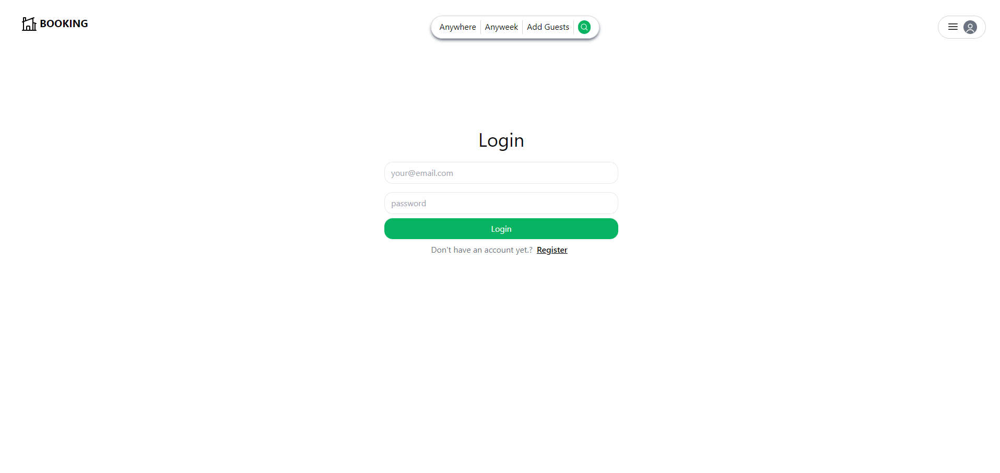
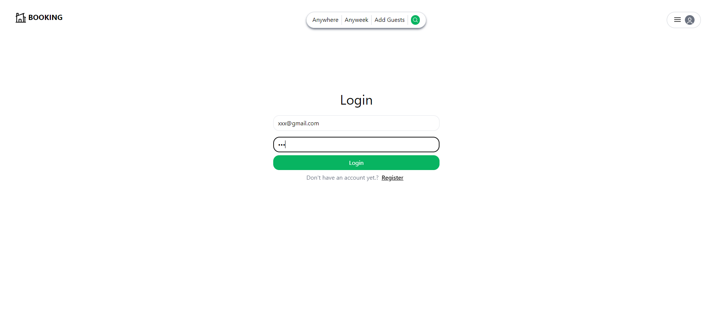
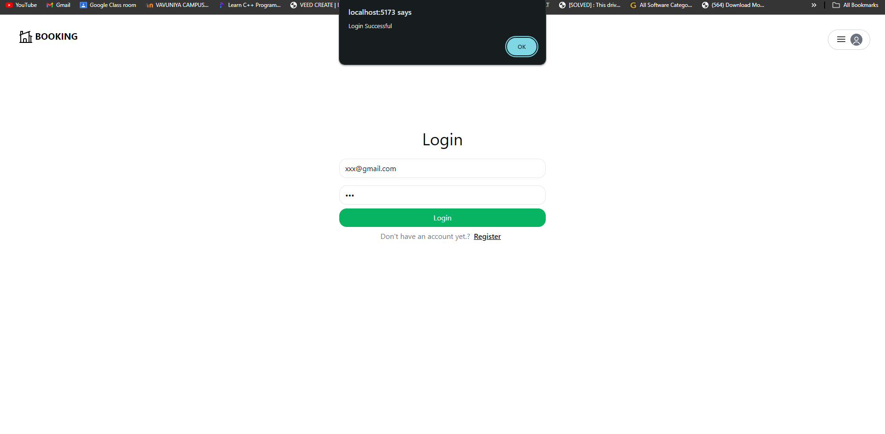
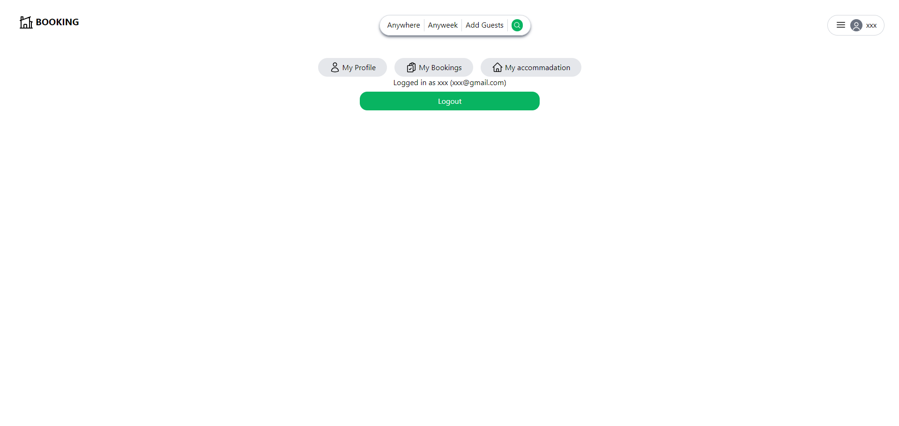
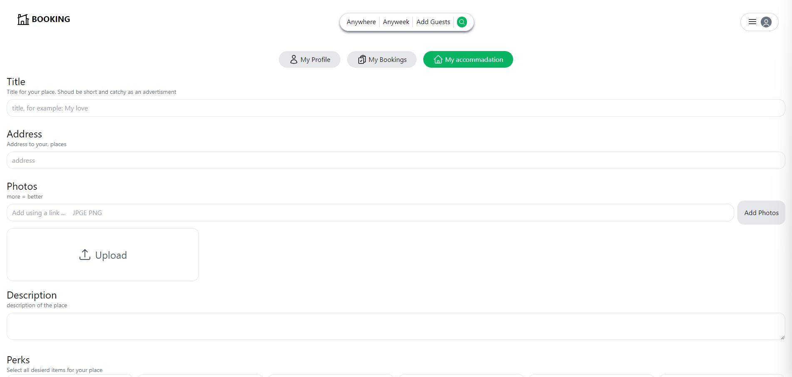

# Fullstack Booking App

Welcome to the Fullstack Booking App! This web application allows users to book various services. It is built using a modern tech stack, including React, MongoDB, Vite, Tailwind CSS, Express, and Node.js.

## Features

- **User Authentication:** Secure user registration and login.
- **Booking System:** Users can easily browse and book available services.
- **Responsive Design:** A mobile-friendly interface for a seamless experience.

## Tech Stack

- **Frontend:**
  - React: A JavaScript library for building user interfaces.
  - Vite: A fast-build tool for modern web development.
  - Tailwind CSS: A utility-first CSS framework.
  
- **Backend:**
  - Express: A minimal and flexible Node.js web application framework.
  - Node.js: A JavaScript runtime for server-side development.
  - MongoDB: A NoSQL database for storing application data.

## Preview

